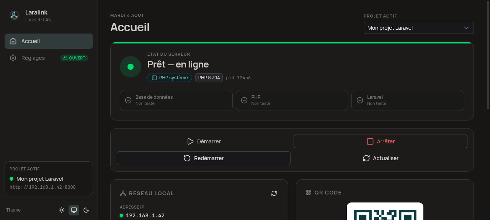
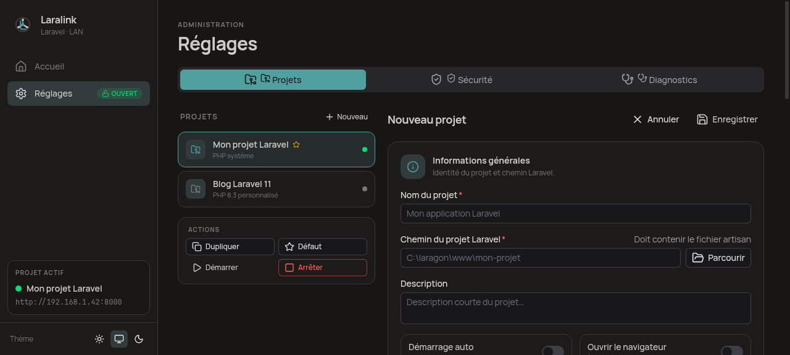

<p align="center">
  
</p>

<h1 align="center">LARALINK</h1>

<p align="center">
  Gérez et lancez vos projets <strong>Laravel</strong> locaux sur votre <strong>réseau local</strong> —<br />
  URL d'accès et QR code pour téléphone, tablette et tout appareil du même Wi‑Fi.
</p>

<p align="center">
  <a href="https://github.com/STIFLEUR390/laralink/actions"></a>
  
  
  
  
  
</p>

<p align="center">
  
</p>

---

## Table des matières

- [Présentation](#présentation)
- [Fonctionnalités](#fonctionnalités)
- [Stack technique](#stack-technique)
- [Comment ça marche](#comment-ça-marche)
- [Démarrage rapide](#démarrage-rapide)
- [Interface en ligne de commande (CLI)](#interface-en-ligne-de-commande-cli)
- [Prise en charge Windows](#prise-en-charge-windows)
- [Structure du projet](#structure-du-projet)
- [Tests](#tests)
- [Intégration continue & releases](#intégration-continue--releases)
- [Périmètre v1](#périmètre-v1)
- [Licence](#licence)

## Présentation

**Laralink** est une application desktop [Tauri 2](https://v2.tauri.app) construite avec [Nuxt 4](https://nuxt.com) et [Nuxt UI](https://ui4.nuxt.dev). Elle simplifie le lancement d'un projet Laravel sur une machine hôte (Windows en priorité, Linux supporté) :

1. elle vérifie les **prérequis techniques** (chemin Laravel, `artisan`, PHP, base de données, port libre) ;
2. elle lance `php artisan serve` avec un binding réseau adapté ;
3. elle détecte l'**adresse IPv4 locale** et affiche une **URL + un QR code** utilisables sur n'importe quel appareil du même réseau.

Chaque projet garde sa propre configuration (runtime PHP, base de données, port, application de pré-lancement), le tout stocké durablement dans une base SQLite avec migrations versionnées.

<p align="center">
  
</p>

## Fonctionnalités

| | |
|---|---|
| 🗂️ **Multi-projets Laravel** | Chaque projet a sa propre config : chemin, runtime PHP, base de données, port préféré, pré-lancement. Un seul projet actif à la fois (v1). |
| 🐘 **Multi-runtimes PHP** | `system_php` (PATH), `custom_php` (chemin explicite, validé avant enregistrement) ou `phprs_experimental` (avertissement : support Laravel « planned »). |
| 🚀 **Launcher intégré** | Vérification DB → validation PHP → port libre → `php artisan serve --host=0.0.0.0 --port={port}`, avec logs temps réel. |
| 🌐 **Réseau local** | Détection IPv4 (filtre Docker/virtual), URL construite automatiquement, QR code scannable, copie en un clic (presse-papiers natif). |
| 🩺 **Diagnostics** | Chemin Laravel, fichier `artisan`, PHP, base de données, port, réseau — exécutables à la demande, historisés. |
| 🔒 **Réglages protégés** | Mot de passe haché **Argon2**, verrouillage temporaire après 5 échecs. L'accueil reste libre d'accès. |
| 🔔 **Notifications natives** | Alerte « projet en ligne » au démarrage, notification de mise à jour disponible. |
| 💾 **Persistance SQLite** | 9 tables, migrations versionnées, historique des sessions de lancement et logs. |
| ⚡ **Confiance & confort** | Autostart au boot, instance unique (focus + CLI), démarrage auto du projet par défaut, tray icon. |
| ⌨️ **CLI** | `laralink start <slug>` / `laralink stop <slug>` depuis le terminal — même quand l'application tourne déjà. |
| 🔄 **Mises à jour** | Plugin updater connecté aux releases GitHub (`latest.json` auto-généré en CI). |

## Stack technique

| Couche | Technologie | Version |
|---|---|---|
| Desktop shell | [Tauri](https://v2.tauri.app) | 2.11 (Rust) |
| Frontend | [Nuxt](https://nuxt.com) + [Nuxt UI](https://ui4.nuxt.dev) | 4.5 / 4.10 |
| UI | Vue 3 (Composition API, `<script setup>`) | 3.5 |
| État | Pinia | 4.0 |
| Base de données | SQLite (rusqlite, bundled) | 0.32 |
| Hachage | Argon2 | 0.5 |
| Checks DB | mysql + postgres (clients natifs) | 26 / 0.19 |
| QR code | qrcode (canvas) | 1.5 |
| Validation | zod | 4.3 |
| Plugins Tauri | dialog, clipboard, cli, autostart, log, notification, opener, single-instance, updater | 2.x |

## Comment ça marche

Au lancement d'un projet, Laralink exécute le flux suivant (journalisé étape par étape dans l'UI) :

1. Chargement de la configuration du projet
2. Vérification du chemin Laravel
3. Vérification de la présence du fichier `artisan`
4. Lancement de l'application de pré-lancement si configurée (ex. Laragon, WampServer)
5. Attente de la disponibilité de la base de données (MySQL / MariaDB / PostgreSQL / SQLite)
6. Validation du runtime PHP choisi
7. Choix d'un port libre (préféré → 8000+ → éphémère)
8. Lancement de `php artisan serve --host=0.0.0.0 --port={port}` (processus capturé, arrêt par `taskkill /T` sur Windows)
9. Détection de l'IPv4 locale et construction de l'URL `http://<ip>:<port>`
10. Affichage de l'URL + génération du QR code

## Démarrage rapide

### Prérequis

- [Bun](https://bun.sh) ≥ 1.3
- [Rust](https://rustup.rs) ≥ 1.77 + [dépendances système Tauri](https://v2.tauri.app/start/prerequisites/)
- PHP dans le PATH (ou runtime personnalisé par projet)

### Développement

```sh
bun install
bun run tauri:dev
```

### Build

```sh
bun run tauri:build
# Linux : AppImage / .deb / .rpm — Windows : NSIS (.exe) + MSI
```

## Interface en ligne de commande (CLI)

Laralink expose une CLI via le plugin Tauri :

```sh
laralink start <slug>     # démarre le projet (ouvre l'app si nécessaire)
laralink stop <slug>      # arrête le projet
laralink --project <slug> # équivalent de start
```

Le slug est généré automatiquement depuis le nom du projet (ex. « Mon Blog » → `mon-blog`). Si l'application est déjà ouverte, la commande se transmet à l'instance existante (plugin single-instance) et la fenêtre reçoit le focus.

## Prise en charge Windows

Laralink cible **Windows en priorité** (ainsi que Linux). Le code Rust est cross-platform :

- arrêt des processus via `taskkill /PID /T /F`, détection via `tasklist`,
- fenêtres console masquées (`CREATE_NO_WINDOW`) lors du lancement de PHP,
- chemins et exécutables gérés avec `std::path::PathBuf`.

### Build Windows (installateurs NSIS + MSI)

Le build natif Windows est réalisé par le pipeline **GitHub Actions** (`.github/workflows/release.yml`) sur un runner `windows-latest` — il produit l'installateur `Laralink_<version>_x64-setup.exe`, le MSI, leurs signatures, et régénère `latest.json` pour l'updater.

```sh
# 1. Taguer une version (ex. v0.1.1) et pousser :
git tag v0.1.1 && git push origin v0.1.1

# 2. Le workflow build les assets Windows + Linux et crée une release brouillon.
#    Publiez-la depuis l'onglet Releases quand les checks sont verts.
```

> 💡 Les secrets GitHub `TAURI_SIGNING_PRIVATE_KEY` / `TAURI_SIGNING_PRIVATE_KEY_PASSWORD`
> doivent être configurés pour signer les installateurs (clé générée via `bunx tauri signer generate`).

### Build local sous Windows

```sh
bun install
bun run tauri:dev      # développement
bun run tauri:build    # installateur NSIS/MSI
```

Prérequis Windows : [WebView2](https://developer.microsoft.com/microsoft-edge/webview2/) (installé par l'installateur), PHP dans le PATH (ou runtime personnalisé), et les outils [Visual Studio Build Tools](https://learn.microsoft.com/cpp/build/vscpp-step-0-installation) pour Rust.

## Structure du projet

```text
laralink/
├── app/                          # Frontend Nuxt 4 (SPA)
│   ├── pages/
│   │   ├── index.vue             # Accueil : statut, URL, QR code, contrôles, logs
│   │   └── settings.vue          # Réglages (protégés) : projets, sécurité, diagnostics
│   ├── components/               # 18 composants (forms projet, cartes, gate…)
│   ├── stores/laralink.ts        # Store Pinia (projets, statut, logs, réglages)
│   ├── services/commands.ts      # Wrapper typed des commandes Tauri
│   ├── composables/              # useClipboard (natif), usePicker (dossier/fichier)
│   └── types/                    # Contrat TypeScript ↔ Rust
├── src-tauri/                    # Backend Rust
│   ├── migrations/               # SQL versionné (0001_init → 0003_sessions)
│   ├── src/
│   │   ├── lib.rs                # Builder Tauri, plugins, CLI, updater, tray
│   │   ├── commands/             # projects, runtime, launcher, network, security, diagnostics
│   │   ├── services/             # laravel_launcher, process_manager, php_runtime,
│   │   │                         # db_checker, port_scanner, network_detector, password
│   │   ├── models.rs             # Contrat sérialisé des données
│   │   ├── db.rs                 # Connexion SQLite + migrations
│   │   └── tests.rs              # 8 tests unitaires + 1 test e2e (serveur PHP réel)
│   ├── capabilities/main.json    # Permissions minimales (principe du moindre privilège)
│   └── tauri.conf.json           # Fenêtre, CLI, updater, bundle
├── .github/workflows/
│   ├── ci.yml                    # Tests Rust + build frontend (push/PR)
│   └── release.yml               # Build Windows + Linux + release + latest.json
└── package.json
```

## Tests

```sh
cd src-tauri && cargo test                 # 8 tests unitaires (migrations, CRUD, hash, ports…)
cd src-tauri && cargo test -- --ignored    # + test e2e : lance un vrai `php artisan serve` (exige PHP)
bun run generate                           # build frontend de validation
```

Le CI (`ci.yml`) exécute ces vérifications sur chaque push/PR.

## Intégration continue & releases

| Workflow | Déclencheur | Actions |
|---|---|---|
| `ci.yml` | push/PR sur `master` | deps Linux, `bun run generate`, `cargo test` |
| `release.yml` | tag `v*` ou manuel | build matrix `ubuntu-22.04` + `windows-latest`, signature, release brouillon, `latest.json` |

Les secrets nécessaires au repo : `TAURI_SIGNING_PRIVATE_KEY` et `TAURI_SIGNING_PRIVATE_KEY_PASSWORD`.

## Périmètre v1

**Inclus** : desktop Tauri (Windows/Linux), multi-projets, multi-runtimes PHP, launcher LAN avec checks, QR code, mot de passe Argon2, SQLite versionné, CLI, notifications, updater, autostart, single-instance, presse-papiers natif.

**Hors périmètre v1** : publication Internet publique, HTTPS automatique, exécution simultanée garantie de plusieurs projets, gestion d'équipe, déploiement cloud.

## Licence

MIT © 2024–2026 [STIFLEUR390](https://github.com/STIFLEUR390)
